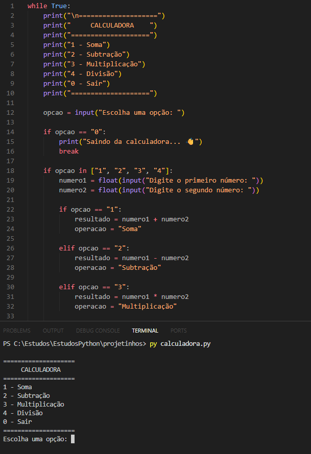

# Calculadora em Python

Projeto simples de uma calculadora feita em Python com menu interativo no terminal.

## Funcionalidades

- Soma
- Subtração
- Multiplicação
- Divisão
- Menu infinito
- Tratamento de divisão por zero

## 📸 Preview do projeto



## Como executar

```bash
py calculadora.py
